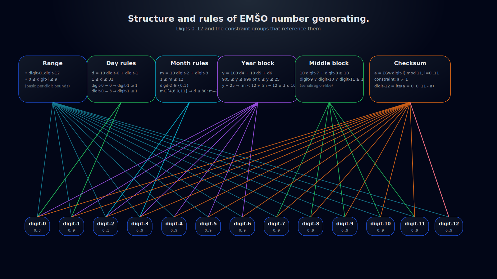

# emso-gen

This is `emso-gen` - a tool for generating EMŠO numbers with the helf of SMT solvers.

This is a research project that demonstrates how SMT solvers can be used for generating random numbers.

## Chart

## Author

- Oto Brglez

## Research

- [Z3 Sequences](https://www.philipzucker.com/z3-rise4fun/sequences.html)
- [Z3 @ GitHub](https://github.com/Z3Prover/z3)
- [Wikipedia / Enotna matična številka občana](https://sl.wikipedia.org/wiki/Enotna_mati%C4%8Dna_%C5%A1tevilka_ob%C4%8Dana)
- [UL 345. Uredba o načinu določanja osebne identifikacijske številke](https://www.uradni-list.si/glasilo-uradni-list-rs/vsebina?urlid=19998&stevilka=345)
- [YouTube: Calle "ZetaTwo" Svensson / SMT in reverse engineering, for dummies](https://youtu.be/b92CW-NZ3l0?si=fYKUtI6rpO7Ch9IZ)
- [Using z3 To Solve Logic Puzzles](https://www.wdj-consulting.com/blog/logicpuzzle-z3/)